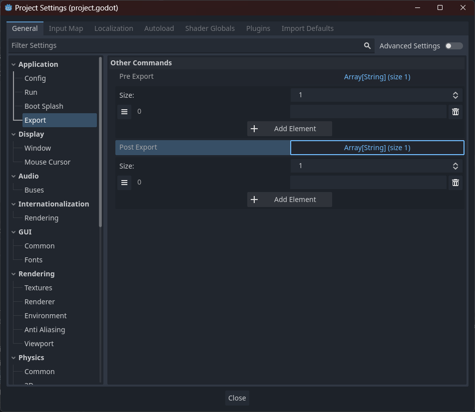
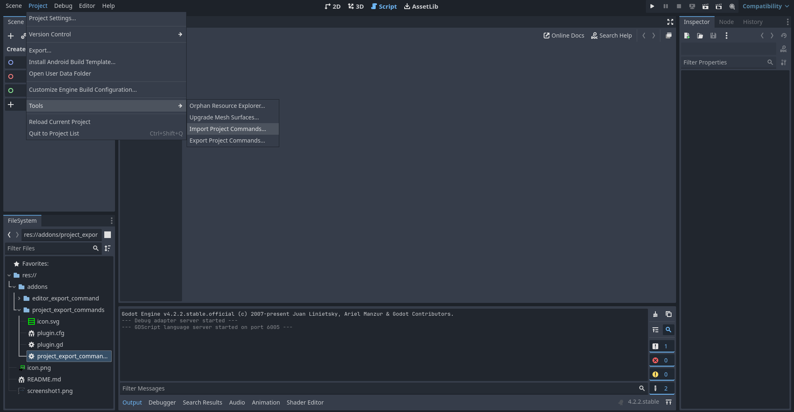

# Godot Editor Export Command

A Godot plugin making it easy to have command line comands run during export of projects.

This plugin includes both ``EditorExportCommand`` and ``ProjectExportCommands``.

## ``ProjectExportCommand``

``ProjectExportCommand`` is a simple editor plugin that runs specific commands set in ``ProjectSettings`` during export, allowing for simpler commands to be run during export without having to extend ``EditorExportCommand``.

``ProjectExportCommand`` also allows for the easy exporting and importing of commands set in the editor to a json file. You can find both the export and import options in the ``Project > Tools`` menu of the editor.

## ``EditorExportCommand``

``EditorExportCommand`` is a simple and usefull abstract base class that can be extended to connect more complex command line tools to the Godot export pipline. This is mostly intended to be used as a common base for future plugins that desire to incorporate otherwise not offically supported build pipline tools into Godot exporting. ``ProjectExportCommand`` is an example of how ``EditorExportCommand`` is meant to be extended, and can be used as a template.
